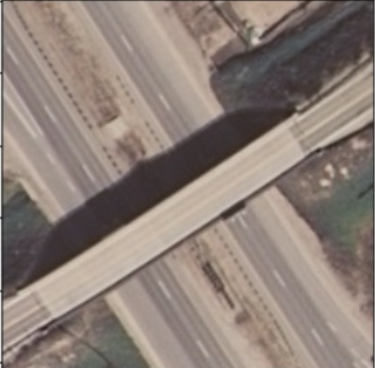

# GNR-638 Assignment 3  
Submitted by: Siddhant Chourasia and Prankul Yadav

---

This project aims to perform land use classification using deep learning techniques, specifically by training a convolutional neural network (CNN) model on the UC Merced Land Use dataset. The dataset consists of 21 land use classes, with 100 images per class. The model is trained on 70% of the data, validated on 10%, and tested on the remaining 20%. Our goal is to classify land use types based on images and visualize class-specific activations to better understand the model’s decision-making process.

The UC Merced Land Use dataset consists of images from various land use classes such as forests, beaches, highways, and more. The images are resized to 224x224 pixels to fit the input size expected by the CNN model.

The main objectives are:
- To explore the dataset and prepare it for training.
- To implement a CNN model for image classification.
- To train the model on the dataset and evaluate its performance on the test set.
- To generate and visualize Class Activation Maps (CAM) to interpret the model's predictions.

## Results

Loss curve:

Here, we visualize the model's training loss over the course of the epochs. The loss generally decreases as training progresses, indicating that the model is learning to classify the images more accurately.

---

### Detailed Description of the Code:

#### **Data Preprocessing:**
- The dataset is loaded from a specified directory using `torchvision.datasets.ImageFolder`. The data is preprocessed with transformations such as resizing the images to 224x224, converting them into tensors, and normalizing with standard values typically used for models pre-trained on ImageNet.

#### **Model Architecture:**
- The `SmallCNN` class defines a basic CNN model with three convolutional layers, followed by two fully connected layers. It employs ReLU activations, max pooling, and a final classification layer.
- The model is trained using CrossEntropyLoss and the Adam optimizer.

#### **Training:**
- The `train_model` function handles the model training loop. It iterates over the dataset for a fixed number of epochs, computing the loss at each step and updating the model’s weights using backpropagation.

#### **Class Activation Map (CAM):**
- The `get_cam` function generates a Class Activation Map by first extracting the features from the convolutional layers, then calculating the importance of each feature map by weighting them with the class-specific output weights from the fully connected layer.

---

### **Results and Visualizations:**

During the testing phase, the model is able to predict the land use class of a given image. Here’s an example of visualizing the prediction and the corresponding Class Activation Map (CAM), which highlights the regions of the image that are most influential for the model’s decision.

- **Original Image**:
  
- **Class Activation Map**:
  

This helps in understanding which regions of the image the model is focusing on while making predictions.
